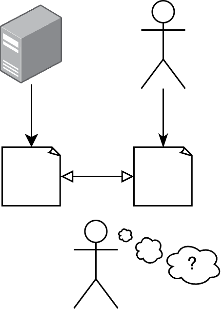

# Neural detection of Al-generated text

  

## Introduction

According to Yandex search data, interest in neural networks has grown more than 15 times since
the beginning of 2022. However, it is hard to find if the text was written by humans or just generated
by a neural network due to significantly increased quality of generative networks.
This could lead to problems related to authenticity and regulations as well as other unethical usages
of such network including plagiarism, generating fake news, spamming, and so on. Thus, the generated
texts identification comes to be a relevant problem nowadays, **so the goal of this work is to train a
model that could successfully determine if the text was generated by a model or written by a human.**

## The concept description

The text recognition pipeline we developed is anchored in the utilization of an artificial model to
discern and generate responses to a dataset sourced from the [Yahoo Answers QA repository](https://huggingface.co/datasets/yahoo_answers_qa).
This dataset encompasses a rich collection of
90,000 questions posed and answered by real individuals on the Internet. The primary objective of
our pipeline is to employ cutting-edge models, specifically [Llama 7B](https://github.com/facebookresearch/llama) from Meta and
[Phi-1.5](https://huggingface.co/microsoft/phi-1_5) from Microsoft, to provide answers to these questions, thereby creating a comprehensive training
dataset for subsequent classification models.

## Table of content

Below you can found the list of Jupyter notebooks in chronological order with description.

1. `llama.ipynb` [[link](llama.ipynb)] - In this notebook, the original dataset is run through the Llama model in order to
obtain artificially generated text.
2. `phi.ipynb` [[link](phi.ipynb)] - In this notebook, the original dataset is run through the Phi model in order to obtain
artificially generated text.
3. `final_dataset.ipynb` [[link](final_dataset.ipynb)] - This notebook contains code for creating the final dataset. File with the
original dataset and Llama’s answer column is connected to the answers of Phi network. After that,
training, validation and test datasets are created from a single merged dataset.
4. Classification models
    - `deberta.ipynb` [[link](deberta.ipynb)] - DeBERTA text classification model.
    - `recurrent.ipynb` [[link](recurrent.ipynb)] - Recurrent network text classification model.
    - `t5.ipynb` [[link](t5.ipynb)] - T5 text classification model.
5. `plots.ipynb` [[link](plots.ipynb)] - Notebook with resulting plots.

## Report

The report (`report.pdf`) is [available here](report.pdf). It based on [Latex-g7-32](https://github.com/latex-g7-32/latex-g7-32)
template that complies with the GOST 7.32 standard.
